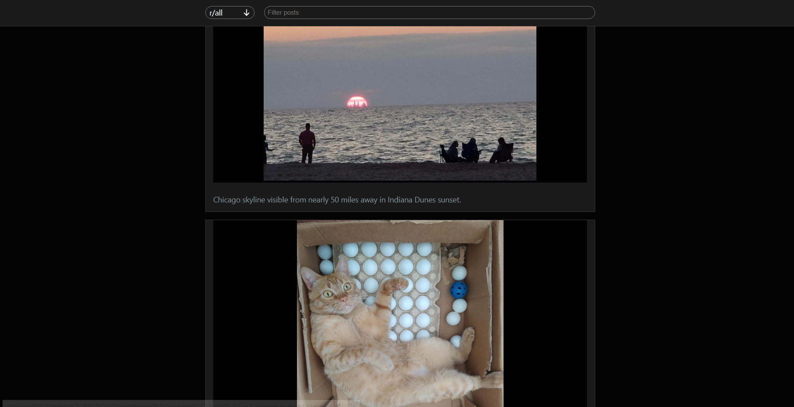

[](https://github.com/salahzoabi/reddit-mini)

# Simple Reddit CLient

This is the repo for [Reddit mini](https://github.com/salahzoabi/reddit-mini).

## Table of contents

-   [Table of contents](#table-of-contents)
-   [Introduction](#introduction)
-   [Codebase](#codebase)
    -   [Technologies](#technologies)
    -   [Folder structure](#folder-structure)
-   [Setup Process](#setup-process)
-   [Acknowledgments](#acknowledgments)

# Introduction

Reddit Mini is a basic Reddit client that enables the viewing of Reddit posts and comments. It's built as a single-page responsive application using React and React Query, and it retrieves data from Reddit through the JSON API. It's been optimized for both mobile and desktop devices. I'm currently working on this project to learn React.

This is an ongoing project and I plan to add more functionalities and enhance it in the future.

# Codebase

## Technologies

- **Javascript** & **CSS**
-   **React**: Front-end library
-   **React Query**: Data synchronization library
-   **React Router**: Routing library

## Folder structure

```sh
reddit-mini/
├── public     # Public files used on the frontend
└── src        # Frontend SPA

reddit-mini/src
├──  assets        # Styling, icons and images
├── components     # Reusabble parts
└── pages          # Main pages
```


## Setup Process

- Clone or download the repo
- Open the directory and run `npm install` to install
- Run development application by using `npm start`

## Acknowledgments

The project utilizes the [Reddit JSON Api](https://github.com/reddit-archive/reddit/wiki/JSON) to obtain data from [Reddit](https://www.reddit.com/)

The project was assigned as part of [Codecademy](https://www.codecademy.com)'s front-end engineering course curriculum, with the objective of demonstrating and applying the skills and techniques learned up to that point.